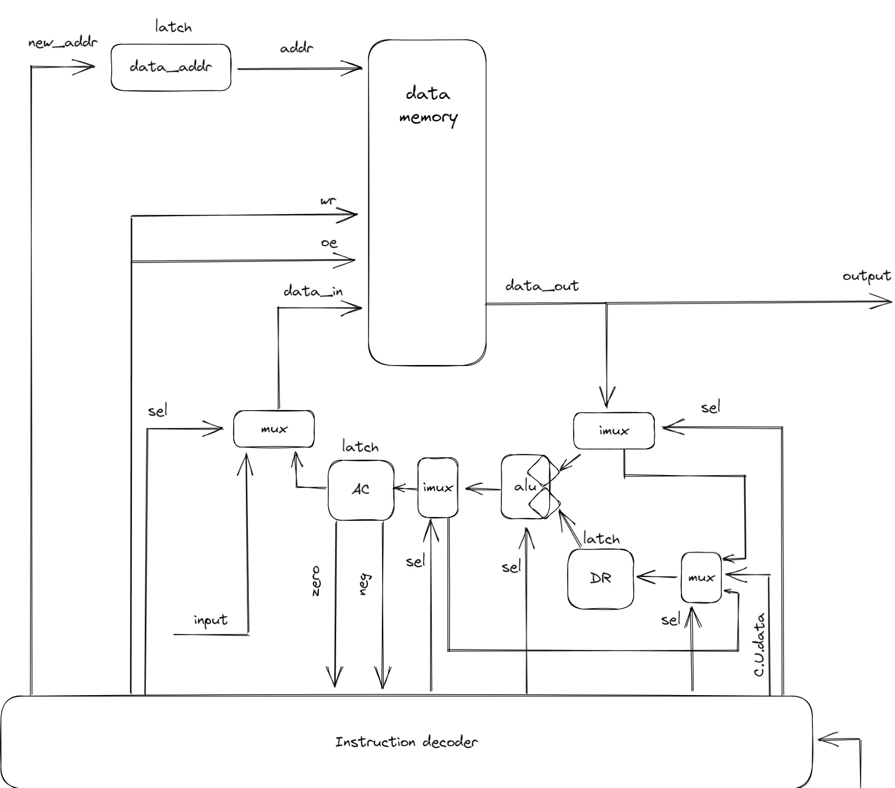
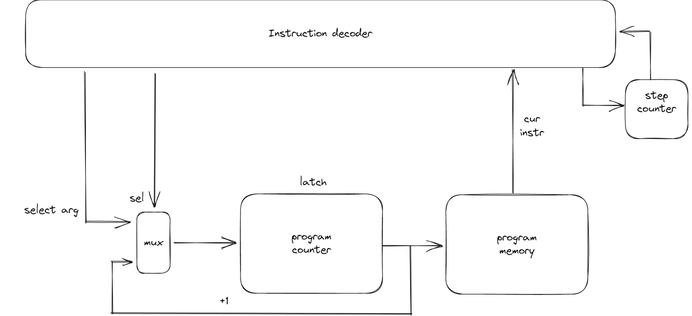

# Лабораторная работа по АК №3

## Вариант 
####  lisp | cisc | harv | hw | instr | struct | stream | port | prob1

## Язык программирования

### Синтаксис языка lisp
Синтаксис языка Лисп в форме Бэкуса — Наура определяется следующим образом:
``` ebnf
<S-expression>      := "(" <Operation> ")"

<Operation> 	    := <F0>
		    |  <F1> <Argument>
		    |  <F2> <Argument> <Argument>
		    |  <F1+> <Arguments>
       		    |  <F2+> <Argument> <Arguments>
					
<Arguments>	    := <Argument>
	            |  <Argument> <Arguments>
             
<Argument>	    := <Variable>
		    |  <Number>
	            |  (<Argument>)

<F0>		    := "read"
<F1>		    := "print"
<F2>		    := "defvar" | "setq" | "dotimes" | "format" | "=" | "mod"
<F1+>		    := "cond" | "loop"
<F2+>		    := "+" | "-"| "*" | "/"
                       
<Variable>          := <letter>
	            |  <letter> <Variable>

<letter>            := "a" | "b" | ... | "z" | "A" | "B" | ... | "Z" | "_"
          
<Number>            := <digit>
	            |  <digit> <Variable>

<digit>	            := "0" | "1" | "2" | ... | "9"
                       

```

### Операции

- `+` Функция сложения, суммирует все параметры, возвращает результат
- `-` Функция вычитания, вычитает из первого параметра все остальные, возвращает результат
- `*` Функция умножения, умножает все параметры, возвращает результат
- `/` Функция деления, делит первый параметр на следующий и так далее, возвращает результат
- `mod` Данная функция принимает два аргумента, возвращает остаток от деления первого аргумента на второй
- `defvar` Функция объявления переменной, принимает на вход "имя переменной" "значение"
- `setq` Функция изменения значения существующей переменной, принимает на вход "имя переменной" "новое значение"
- `=` Функция принимает на вход два аргумента, если они не равны, то происходит переход на новый адрес. Поведение функции аналогично bne
- `cond` Аналог switch case.
- `dotimes` Функция объявления цикла
- `loop` Функция объявления бесконечного цикла
- `print` Функция печати в стандартный вывод числа
- `format` Функция печати в стандартный вывод символа 
- `read` Функция чтения из стандартного входного потока

## Cистема команд

Особенности процессора:

- Машинное слово -- 32 бита, знаковое.
- Память данных:
    - адресуется через регистр `data_address`, значение может быть загружено только из Control Unit;
    - может быть записана:
        - из аккумулятора `AC`;
        - с порта ввода;
    - может быть прочитана в аккумулятор `AC`
    - может быть прочитана в регистр данных `DR`
- Регистр аккумулятора: `AC`:
    - может быть подан на вывод;
    - используются флаги zero, neg;
    - см. память данных.
- Регистр данных `DR`:
    - Используется для получения операндов из Control Unit, чтения данных из data memory, сохранения результатов ALU
    - Может хранить данные
    - Содержимое передается в ALU
- ALU
    - Производит арифметико - логические операции
    - На вход подаются данные из `DR` и data memory
    - Поддерживаемые операции:
        - add - сложение двух операндов
        - sub - вычесть из значения на левом входе значение на правом входе
        - mul - умножение двух операндов
        - div - поделить значение на левом входе значение на правом входе
        - mod - остаток от деления значения левого входа от правого входа
        - movv - подать на выход значение левого входа (Для чтения данных)
    - Результат записывается в `AC` или `DR`
- `program_counter` -- счётчик команд:
    - Может быть перезаписан из Control Unit
    - Может быть инкрементирован
    
### Набор инструкций

| Syntax    | Mnemonic | Arguments        | Тактов | Comment                                                                                             |
|:----------|:---------|------------------|:------:|-----------------------------------------------------------------------------------------------------|
| `defvar`  | movv     | addr, value      |   3    | Устанавливает значение $2 по данному адресу $1                                                      |
| `setq`    | mov      | addr             |   2    | Загружаем значения из AC в $1                                                                       |
| `mod`     | mod      | addr, value      |   2    | Сохраняет в AC остаток от деления значения по адресу $1 на $2                                       |
| `=`       | bne      | addr             |   1    | Аналог if. Если AC != 0, то прыгаем на $2                                                           |
| `+`       | add      | addr, addr       |   4+   | Сложить значения, лежащие по адресам $1 $2, результат в AC                                          |
| `-`       | sub      | addr, addr       |   4+   | Вычесть из значения, лежащего по адресу $1 значение в адресе $2, результат в AC                     |
| `/`       | div      | addr, addr       |   4+   | Поделить значение, лежащее по адресу $1 на значение по адресу $2, результат в AC                    |
| `*`       | mul      | addr, addr       |   4+   | Умножить значения, лежащие по адресам $1 $2, результат в AC                                         |
| `dotimes` | loop     | addr, addr, addr |  5/6   | Если значение по адресу $3 < значение по адресу $2, то переходим по адресу $1 и делаем инкремент $3 |
| `read`    | rd       | addr             |   2    | Прочитать один символ с потока ввода                                                                |
| `print`   | print    | addr             |   2    | Вывод числа по адресу $1                                                                            |
| `format`  | printf   | addr             |   2    | Вывод символа по адресу $1                                                                          |
| `loop`    | jp       | addr             |   1    | Безусловный переход по адресу $1                                                                    |
|           | halt     | 0                |   0    | остановка                                                                                           | 

### Кодирование инструкций

- Машинный код сериализуется в список JSON.
- Одна команда функции - одна инструкция.
- Индекс списка -- адрес инструкции. Используется для команд перехода.

Пример:

```json
    {
        "opcode": "add",
        "arg": [
            0,
            1
        ]
    }
```

где:

- `opcode` -- строка с кодом операции;
- `arg` -- список аргументов (может отсутствовать);

## Транслятор

Интерфейс командной строки: `translator.py <input_file> <target_file>`

Реализовано в модуле: [translator](translator.py)

Этапы трансляции (функция `translate`):

1. Трансформирование текста в последовательность значимых термов.
2. Проверка корректности программы (парность скобок).
3. Генерация машинного кода.

Правила генерации машинного кода:

- Для учета циклов и других конструкций считается количество открытых и закрытых скобок
- После открывающийся скобки может идти как функция так и её аргументы
- Аргументами функций могут быть переменные, числа, другие функции
- Мы двигаемся по всем значимым термам и формируем машинный код, пока не пройдемся по всем

## Модель процессора

Реализовано в модуле: [machine](./machine.py).

### DataPath



Реализован в классе `DataPath`.

- `data_memory` -- однопортовая, поэтому либо читаем, либо пишем.
- `input` -- вызовет остановку процесса моделирования, если буфер входных значений закончился.

Сигналы (обрабатываются за один такт, реализованы в виде методов класса):

- `latch_data_addr` -- защёлкнуть значение в `data_addr`;
- `latch_acc` -- защёлкнуть в аккумулятор значение с ALU;
- `latch_dr` -- защелкнуть в регистр данных выбранное значение
- `output` -- записать текущее значение `data memory` в порт вывода (обработка на python);
- `wr` -- записать выбранное значение в память:
    - Из регистра `AC`
    - с порта ввода (обработка на python).

Флаги:
- `neg` -- отражает наличие в аккумуляторе отрицательного числа
- `zero` -- отражает наличие нулевого значения в аккумуляторе.

### ControlUnit



Реализован в классе `ControlUnit`.

- Hardwired (реализовано полностью на python).
- Моделирование на уровне инструкций.
- Трансляция инструкции в последовательность (0-6 тактов) сигналов: `decode_and_execute_instruction`.
- `step_counter` необходим для многотактовых команд:
    - в классе `ControlUnit` отсутствует, т.к. моделирование производится на уровне инструкций.

Сигнал:

- `latch_program_counter` -- сигнал для обновления счётчика команд в ControlUnit.

Особенности работы модели:

- Для журнала состояний процессора используется стандартный модуль logging.
- Количество инструкций для моделирования ограничено hardcoded константой.
- Остановка моделирования осуществляется при помощи исключений:
    - `EOFError` -- если нет данных для чтения из порта ввода-вывода;
    - `StopIteration` -- если выполнена инструкция `halt`.
- Управление симуляцией реализовано в функции `simulate`.

## Апробация

В качестве тестов использовано два алгоритма:

1. [hello world](examples/hello.lisp).
2. [cat](examples/cat.lisp) -- программа `cat`, повторяем ввод на выводе.

Интеграционные тесты реализованы тут: [integration_test](test/integration_test.py)

CL:
```yaml
lab3-example:
  stage: test
  image:
    name: python-tools
    entrypoint: [""]
  script:
    - python3-coverage run -m pytest --verbose
    - find . -type f -name "*.py" | xargs -t python3-coverage report
    - find . -type f -name "*.py" | xargs -t pep8 --ignore=E501
    - find . -type f -name "*.py" | xargs -t pylint
```
где:

- `python3-coverage` -- формирование отчёта об уровне покрытия исходного кода.
- `pytest` -- утилита для запуска тестов.
- `pep8` -- утилита для проверки форматирования кода. `E501` (длина строк) отключено.
- `pylint` -- утилита для проверки качества кода. Некоторые правила отключены в отдельных модулях с целью упрощения кода.
- `mypy` -- утилита для проверки корректности статической типизации.
  - `--check-untyped-defs` -- дополнительная проверка.
  - `--explicit-package-bases` и `--namespace-packages` -- помогает правильно искать импортированные модули.
- Docker image `python-tools` включает в себя все перечисленные утилиты. Его конфигурация: [Dockerfile](./Dockerfile).

Пример использования и журнал работы процессора на примере `cat`:
```sh
$ cat examples/foo_input.txt
foo

$ cat examples/cat.lisp
( defvar r 0 )
( loop
 ( setq r ( read ) )
 ( format t r )
)
$ py translator.py examples/cat.lisp target.out
source LoC: 20 code instr: 5

$ cat target.out
[
    {
        "opcode": "movv",
        "arg": [
            0,
            0
        ]
    },
    {
        "opcode": "rd",
        "arg": [
            0
        ]
    },
    {
        "opcode": "printf",
        "arg": [
            0
        ]
    },
    {
        "opcode": "jp",
        "arg": [
            1
        ]
    },
    {
        "opcode": "halt"
    }
]
$ py machine.py target.out examples/foo_input.txt
DEBUG:root:{TICK: 0, PC: 0, ADDR: 0, OUT: 0, AC: 0, DR: 0} movv [0, 0]
DEBUG:root:{TICK: 4, PC: 1, ADDR: 0, OUT: 0, AC: 0, DR: 0} rd [0]
DEBUG:root:input: 'f'
DEBUG:root:{TICK: 7, PC: 2, ADDR: 0, OUT: 102, AC: 0, DR: 0} printf [0]
DEBUG:root:output: '' << 'f'
DEBUG:root:{TICK: 10, PC: 3, ADDR: 0, OUT: 102, AC: 0, DR: 0} jp [1]
DEBUG:root:{TICK: 12, PC: 1, ADDR: 0, OUT: 102, AC: 0, DR: 0} rd [0]
DEBUG:root:input: 'o'
DEBUG:root:{TICK: 15, PC: 2, ADDR: 0, OUT: 111, AC: 0, DR: 0} printf [0]
DEBUG:root:output: 'f' << 'o'
DEBUG:root:{TICK: 18, PC: 3, ADDR: 0, OUT: 111, AC: 0, DR: 0} jp [1]
DEBUG:root:{TICK: 20, PC: 1, ADDR: 0, OUT: 111, AC: 0, DR: 0} rd [0]
DEBUG:root:input: 'o'
DEBUG:root:{TICK: 23, PC: 2, ADDR: 0, OUT: 111, AC: 0, DR: 0} printf [0]
DEBUG:root:output: 'fo' << 'o'
DEBUG:root:{TICK: 26, PC: 3, ADDR: 0, OUT: 111, AC: 0, DR: 0} jp [1]
DEBUG:root:{TICK: 28, PC: 1, ADDR: 0, OUT: 111, AC: 0, DR: 0} rd [0]
DEBUG:root:input: '\n'
DEBUG:root:{TICK: 31, PC: 2, ADDR: 0, OUT: 10, AC: 0, DR: 0} printf [0]
DEBUG:root:output: 'foo' << '\n'
DEBUG:root:{TICK: 34, PC: 3, ADDR: 0, OUT: 10, AC: 0, DR: 0} jp [1]
DEBUG:root:{TICK: 36, PC: 1, ADDR: 0, OUT: 10, AC: 0, DR: 0} rd [0]
WARNING:root:Input buffer is empty!
INFO:root:output_buffer: 'foo\n'
foo

instr_counter:  13 ticks: 36

```

| ФИО                 | алг.  | LoC | code байт | code инстр. | инстр. | такт. | вариант |
|---------------------|-------|-----|-----------|-------------|--------|-------|---------|
| Андрейченко Л. В.   | hello | 23  | -         | 23          | 22     | 55    | -       |
| Андрейченко Л. В.   | cat   | 5   | -         | 5           | 13     | 36    | -       |
| Андрейченко Л. В.   | prob1 | 9   | -         | 15          | 5604   | 14144 | -       |


