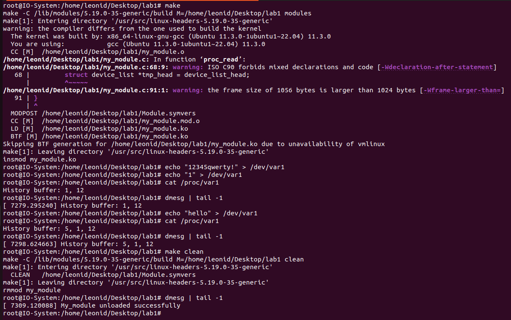

# Лабораторная работа 1

**Название:** "Разработка драйверов символьных устройств"

**Цель работы:** получить знания и навыки разработки драйверов символьных
устройств для операционной системы Linux.

## Описание функциональности драйвера

Написать драйвер символьного устройства, удовлетворяющий
требованиям:
1. Драйвер должен создавать символьное устройство /dev/var1.
2. Драйвер должен создавать интерфейс для получения сведений о
результатах операций над созданным в п.1.1 символьным
устройством: файл /proc/var1.
3. Должен обрабатывать операции записи и чтения в соответствии с
вариантом задания (варианты представлены ниже).

При записи текста в файл символьного устройства должен осуществляться подсчет введенных символов.

Последовательность полученных результатов (количество
символов) с момента загрузки модуля ядра должна выводиться
при чтении созданного файла /proc/var1 в консоль
пользователя.

При чтении из файла символьного устройства в кольцевой
буфер ядра должен осуществляться вывод тех же данных,
которые выводятся при чтении файла /proc/var1.

## Инструкция по сборке

Собрать проект и загрузить модуль в ядро:

* `make`

Удалить модуль из ядра и очистить созданные файлы:
* `make clean`

## Инструкция пользователя

* Из папки проекта соберите и загрузите модуль командой `make`
* Запишите произвольный текст в файл `/dev/var1`, пример `echo "12345" > /dev/var1`
* Прочтите файл `/proc/var1`, пример `cat /proc/var1`
* Также можно просмотреть буфер сообщений ядра командой `dmesg`
* По окончании пользования драйвера, выгрузите его из системы командой `make clean`

## Примеры использования

