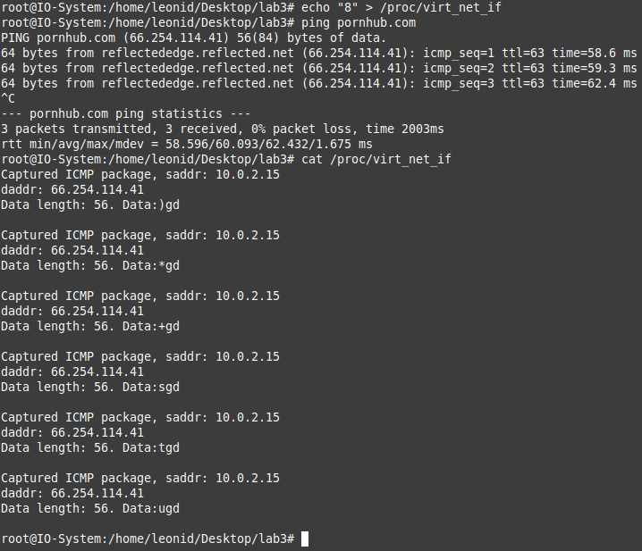

# Лабораторная работа 3

**Название:** "Разработка драйверов сетевых устройств"

**Цель работы:** Получить знания и навыки разработки драйверов сетевых
интерфейсов для операционной системы Linux.

## Описание функциональности драйвера

Драйвер должен создавать виртуальный сетевой интерфейс в ОС
Linux. Созданный сетевой интерфейс должен перехватывать пакеты
родительского интерфейса (eth0 или другого). Пакеты протокола ICMP (Internet Control Message Protocol) – только
тип 8. Вывести данные в файл в директории /proc

## Инструкция по сборке

`make` - собрать проект

`make clean` - очистить проект

## Инструкция пользователя

После сборки запускаем команду ping, которая посылает ICMP посылки на сайт. После этого мы можем проверить результат работы в папке /proc/virt_net_if. 

## Примеры использования

```
root@IO-System:/home/leonid/Desktop/lab3# ping pornhub.com
PING pornhub.com (66.254.114.41) 56(84) bytes of data.
64 bytes from reflectededge.reflected.net (66.254.114.41): icmp_seq=1 ttl=63 time=73.3 ms
64 bytes from reflectededge.reflected.net (66.254.114.41): icmp_seq=2 ttl=63 time=80.0 ms
64 bytes from reflectededge.reflected.net (66.254.114.41): icmp_seq=3 ttl=63 time=79.0 ms
64 bytes from reflectededge.reflected.net (66.254.114.41): icmp_seq=4 ttl=63 time=79.9 ms

root@IO-System:/home/leonid/Desktop/lab3# cat /proc/virt_net_if 
Captured ICMP package, saddr: 10.0.2.15
daddr: 5.255.255.242
Data length: 56. Data:0Mfd

Captured ICMP package, saddr: 10.0.2.15
daddr: 5.255.255.242
Data length: 56. Data:1Mfd

Captured ICMP package, saddr: 10.0.2.15
daddr: 5.255.255.242
Data length: 56. Data:2Mfd
```

## Дополнительное задание 

Конфигурировать модуль во время работы, передавая тип отлавливаемых пакетов в файл. Пример реализации


