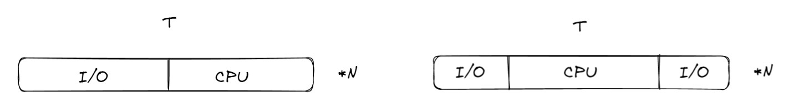
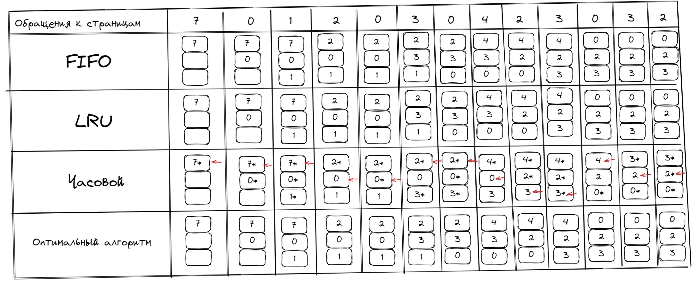
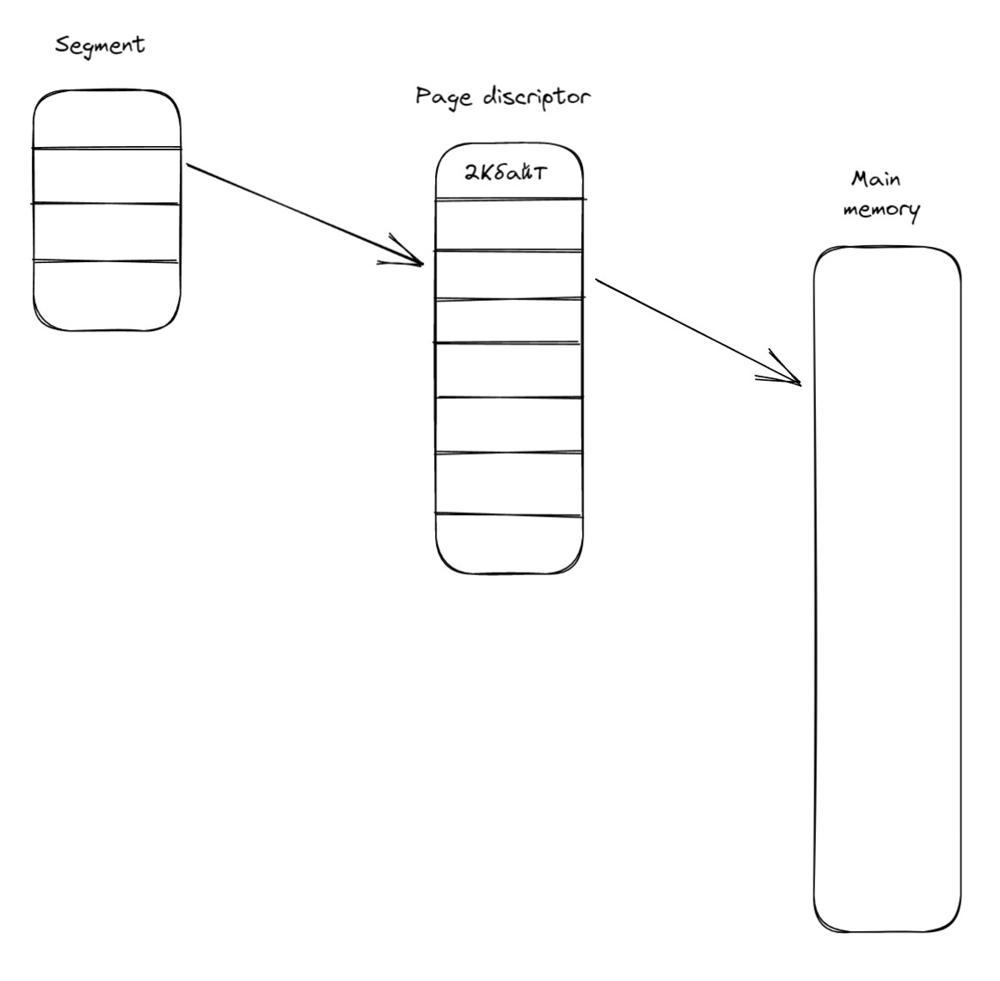
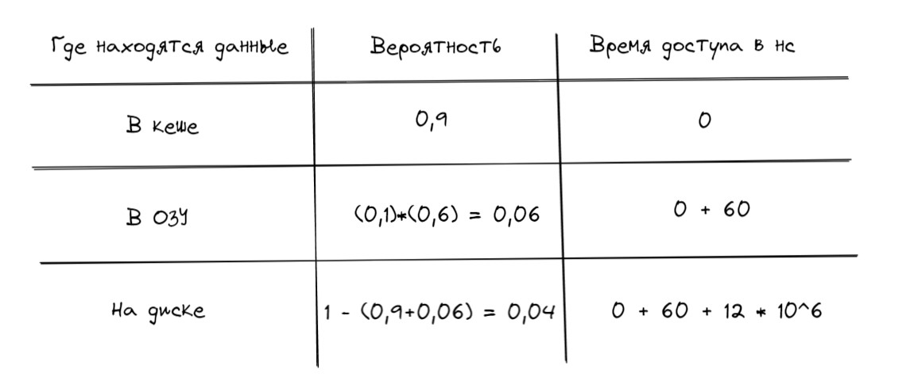

# Задачи для подготовки к рубежному контролю по курсу Операционные Системы 2020/21

## Задание 1.4
>Рассмотрим гипотетический микропроцессор, генерирующий 16-битовые адреса (предположим, например, что счетчик команд и адресные регистры имеют размер 16 бит) и обладающий 16-битовой шиной данных.

> а. Какое максимальное адресное пространство памяти может быть непосредственно доступно этому процессору, если он соединен с "16-битовой памятью"?

> б. Какое максимальное адресное пространство может быть непосредственно доступно этому процессору, если он соединен с "8-битовой памятью"?

> в. Какие особенности архитектуры позволят этому микропроцессору получить доступ к отдельному "пространству ввода-вывода"?

> г. Сколько портов ввода-вывода способен поддерживать этот микропроцессор, если в командах ввода и вывода задаются 8-битовые номера портов? Сколько портов ввода-вывода он может поддерживать с 16-битовыми портами?

------
а) Максимальное адресное пространство, которым процессор может непосредсвенно оперировать - 2^16 бит = 65 536 бит = 8 Кбайт. 

б) Максимальное адресное пространство, которым процессор может непосредсвенно оперировать - 2^16 бит = 65 536 бит = 8 Кбайт. 

`Разница между а и б лишь в том, что процессор А сможет передавать за раз 16 бит, в процессор Б только 8`

в) Memory Mapped I/O - эта технология позволяет выполнять запись / чтение в порты устройств ввода-вывода так же, как чтение / запись в обычную память. Однако вы используете адресное пространство физической памяти для своих устройств ввода-вывода с привязкой к памяти. Т.е. съедаете свою память данных. Другой же подход - Port Mapped I/O заключается в том, что у вас есть отдельное адресное пространство для ваших устройств ввода-вывода, и вы можете использовать весь диапазон адресации памяти для доступа к памяти.

г) При 8 битовых портах их максимальное количество равно 2^8 = 256шт. При 16 бит результат тот же так как, для кодирования портов будет занята вся память, учитывая размер команды не смогут помещаться в машинное слово = 16 бит.

## Задание 1.5

> Рассмотрим 32-битовый микропроцессор с 16-битовой внешней шиной данных, ко торая управляется тактовым генератором с тактовой частотой 8 МГц. Пусть цикл шины этого микропроцессора по длительности равен четырем циклам тактового генератора. 

> а)Какую максимальную скорость передачи данных может поддерживать этот процессор? 

> б) Что будет лучше для повышения производительности: сменить его внешнюю шину данных на 32-битовую или удвоить частоту сигнала тактового генератора, поступающего на микропроцессор?
Указание: определите количество байтов, которое может быть передано при каждом цикле
шины.

-----
а) Найдем частоту генерации одного импульса: 1сек/8 000 000 = 125 * 10^-9 сек = 125нс. Цикл шины = 4 * 125 = 500нс.   
Получается что 2 байта передаются каждые 500нс -> скорость равна 2 * 2 * 1000 * 1000 = 4 000 000 bps = 4 Мбайт/сек

б) При шине в 32 бита скорость передачи равна 4 Мбайта/сек * 2 = 8 Мбайт/сек (Так как размер передаваемых даннных в 2 раза больше)

При удвоении частоты 2 байта будут передаваться каждые 250нс скорость равна 2 * 4 * 1000 * 1000 = 8 000 000 bps = 8 Мбайт/сек.

Прирост в производительности одинаковый.

## Задание 1.8

> Контроллер DМА передает символы из внешнего устройства в основную память со скоростью 9600 бит в секунду. Процессор может выбирать команды со скоростью 1 млн команд в секунду. Насколько процессор замедлит свою работу из-за работы DМА?

----

Скорость передачи одного символа: 9600 : 8 = 1200 символов в секунду  
Тогда время передачи одного символа: 1 000 000 / 1200 = 833 мкс   
Время выбора одной команды: 1мкс  
Тогда их отношение: 1 / 833 * 100% = 0,12%

## Задание 2.1

> Предположим, у нас есть многозадачный компьютер, в котором каждое задание имеет идентичные характеристики. В течение цикла вычисления одного задания Т половину времени занимает ввод-вывод, а вторую половину работа процессора. Для выполнения каждого задания требуется N-циклов. Допустим, что для планирования используется простой алгоритм циклического обслуживания и что ввод-вывод может выполняться одновременно с работой процессора. Определите значения следующих величин:
• Реальное время, затрачиваемое на выполнение задания.  
• Среднее количество заданий, которые выполняются в течение одного цикла Т.  
• Доля времени, в течение которого процессор активен (не находится в режиме ожидания).  
Вычислите эти значения для одного, двух и четырех одновременно выполняющихся заданий, считая, что время цикла Т распределяется одним из следующих способов.  
а. В течение первой половины периода выполняется ввод-вывод, а в течение второй - работа
процессора.  
б. В течение первой и четвертой четвертей выполняется ввод-вывод, а в течение второй и
третьей - работа процессора.

----

| Task count | Real time | Average task | %CPU |
| ------ | ------ | ------ | ------ |
| 1 | NT | 1/N | 50 |
| 2 | NT | 2/N | 100 |
| 4 | (4N-2)T | 4/N | 100 |

Для вариантов а б ответ одинаковый так как %CPU одинаковый

## Задание 3.2

Предположим, что в момент времени 5 не используются никакие системные ресурсы, за
исключением процессора и памяти. Теперь рассмотрим следующие события.  
В момент 5: Р1 выполняет команду чтения с дискового устройства 3  
В момент 15: Истекает квант времени Р5  
В момент 18: Р7 выполняет команду записи на дисковое устройство 3  
В момент 20: РЗ выполняет команду чтения с дискового устройства 2  
В момент 24: Р5 выполняет команду записи на дисковое устройство 3  
В момент 28: Выполняется выгрузка процесса Р5 на диск  
В момент 33: Прерывание от дискового устройства 2: чтение Р3 завершено  
В момент 36: Прерывание от дискового устройства 3: чтение Р1 завершено  
В момент 38: Процесс Р8 завершается  
В момент 40: Прерывание от дискового устройства 3: запись Р5 завершена  
В момент 44: Загрузка процесса Р5 с диска  
В момент 48: Прерывание от дискового устройства 3: запись Р7 завершена  
Для каждого из моментов времени 22, 37 и 47 укажите состояние, в котором находится каждый процесс. Если процесс блокирован, укажите событие, которое к этому привело

| PID/Moment | 22 | 37 | 47 |
| ------ | ------ | ------ | ------ |
| P1 | WAIT 3 | RUNNABLE  | RUNNABLE  |
| P3 | WAIT 2| RUNNABLE | RUNNABLE  |
| P5 | RUNNABLE | SUSPEND | RUNNABLE |
| P7 | WAIT 3| WAIT 3 | WAIT 3 |
| P8 | ON CPU | ON CPU | EXIT |

- Wait ожидание события 
- Runnable в очереди ожидания процессора
- ON CPU на процессоре
- SUSPEND выгружен на вторичную память 
- EXIT завершил работу

## Задание 7.2

Рассмотрим схему фиксированного распределения с разделами равного размера, равного 2^16 байт, и общим количеством основной памяти 2^24 байт. Поддерживает ся таблица процессов, включающая указатель на раздел для каждого резидентного
процесса. Сколько битов требуется для этого указателя?

---

По условию размер одной страницы равен 2^16 байт  
Общий размер памяти равен 2^24 байт 
Максимальное количество страниц, которое можно туда запихнуть - 2^24 / 2^16 = 2^8 = 256 штук
Если предположить что каждый процесс будет занимать ровно одну страницу, то для адресации 256 процессов нам хватит 8 бит

## Задание 7.12

Рассмотрим простую страничную систему со следующими параметрами: 2^32 байт
физической памяти; размер страниц - 2^10 байт; 2^16 страниц логического адресного
пространства.  
а. Сколько битов в логическом адресе?  
б. Сколько байт в кадре?  
в. Сколько битов физического адреса определяет кадр?  
г. Сколько записей в таблице страниц?  
д. Сколько битов в каждой записи таблицы страниц? Предполагаем, что каждая запись таблицы страниц содержит бит корректности страницы.

---

а. Количество байт в логическом адресном пространсте (2^16 кол-во страниц лог. пр-ва) * (2^10 размер страницы) = 2^26 -> 26 бит  
б. Кадр такого же размера что и страница -> 2^10 байт  
в. Кол-во страниц(кадров) = 2^32 / 2^10 = 2^22 -> 22 бита  
г. Из условия 2^16 страниц логического адресного  
д. Кол-во бит для кодирования всех страниц + 1 = 22 + 1 = 23 

## Задание 7.14

Рассмотрим простую систему сегментации, при которой используется следующая таблица сегментов:  

| Начальный адрес | Длинна (байт) | 
| ------ | ------ |
| 660 | 248 |
| 1752 | 422|
| 222 | 198 |
| 996 | 604 |

Для каждого из следующих логических адресов определите физический адрес или
укажите, что заданный адрес ошибочен.  
a. 0, 198  
б. 2, 156  
в. 1, 530  
г. 3, 444  
д 0, 222  

---
Расширим таблицу 

| Начальный адрес | Длинна (байт) | Максимальный адрес | Полученный адрес | 
| ------ | ------ | --- | --- |
| 660 | 248 | 908 | 858, 882 |
| 1752 | 422| 2174 | 2282 - неверно  |
| 222 | 198 | 420 | 378 |
| 996 | 604 | 1600 | 1440 |

## Задание 8.1

Предположим, что таблица страниц текущего процесса выглядит так, как показано ниже.
Все числа в таблице - десятичные, вся нумерация начинается с нуля, а все адреса представляют
собой адреса отдельных байтов памяти. Размер страницы равен 1024 байтам.

| Номер виртуальной страницы | Бит присутствия в памяти | Бит обращений | Бит модификации | Номер кадра | 
| ------ | ------ | --- | --- | --- |
| 0 | 1 | 1 | 0 | 4 |
| 1 | 1| 1 | 1 | 7 |
| 2 | 0 | 0 | 0 | - |
| 3 | 1 | 0 | 0 | 2 |
| 4 | 0 | 0 | 0 | - |
| 5 | 1 | 0 | 1 | 0 |

а. Опишите, как именно виртуальный адрес транслируется в физический адрес основной
памяти.  
б. Какой физический адрес (если таковой имеется) соответствует каждому из приведенных
виртуальных адресов? (Вы не должны пытаться обработать прерывание из-за отсутствия
страницы).  
• 1052
• 2221
• 5499

---

а. Для того, чтобы занумеровать все страницы необходимо 3 бита поэтому первые 3 бит виртуального адреса бедет занимать номер страницы, по которому мы получим начальный адрес, к которому нужно будет прибавить смещение - следующие 10 бит  
б. 1052 = 1024 + 28 -> 7й кадр + 28 = 1024 * 7 + 28 = 7196  
2221  = 2 * 1024 + 173 -> Данного кадра нет   
5499 = 5 * 1024 + 379 -> 0й кадр + 379 = 379

## Задание 8.4

Рассмотрим последовательность обращений к страницам
7, 0, 1, 2, 0, 3, 0, 4, 2, 3, 0, 3, 2.
Изобразите диаграмму, подобную показанной на рис. 8.14 и демонстрирующую распределение
кадров для стратегий.  
а. FIFO ("первым вошел первым вышел").  
б. LRU (последний использовавшийся).  
в. Часовой.  
г. Оптимальный (в предположении, что последовательность обращений продолжается как 1, 2, 0, 1, 7, 0, 1).  
д. Перечислите общее количество ошибок страниц и частоту промахов для каждой стратегии.  
Подсчитайте количество ошибок страницы, происшедших после того, как все кадры были
инициализированы.

---

Если задать размер ОЗУ как в примере = 3, то получим

## Задание 8.6

Процесс содержит восемь виртуальных страниц на диске, и ему выделено четыре
фиксированных кадра в основной памяти. Далее выполняются обращения к следующим
страницам: 1, 0, 2, 2, 1, 7, 6, 7, 0, 1, 2, 0, 3, 0, 4, 5, 1, 5, 2, 4, 5, 6, 7, 6, 7, 2, 4, 2, 7, 3, 3, 2, 3.  
а. Укажите последовательность размещения страниц в кадрах при использовании алгоритма
замещения наиболее долго не использовавшейся страницы. Вычислите результативность
обращения к основной памяти (считаем, что изначально все кадры пусты).  
б. Выполните то же задание для алгоритма "первым вошел - первым вышел".  
в. Сравните результативности обращения к основной памяти, вычисленные в первых двух
заданиях, и прокомментируйте эффективность использования ука занных алгоритмов
применительно к данной последовательности обращений.

 --- 

TODO Аналогично 8.4

## Задание 8.10

Предположим, что размер страницы занимает 4 Кбайт и что запись таблицы страниц
занимает 4 байт. Сколько уровней таблиц страниц потребуется для отображения
64-битового адресного пространства, если таблица верхнего уровня занимает одну
страницу? 

---

Из условия в таблице страниц верхнего уровня может поместиться 4 * 2^13 / 4 * 2^3 = 2^10 штук
Тогда ворой уровень сможет адресовать 2^10 * 2^12 = 2^22 страниц. Продолжая процесс получаем ответ 5.

## Задание 8.17

Предположим, что задание разделено на четыре сегмента одинакового размера и что дпя
каждого сегмента система строит таблицу дескрипторов страниц с восемью записями. Таким
образом, описанная система представляет собой комбинацию сегментации и страничной
организации. Предположим также, что размер страницы равен 2 Кбайт.  
а. Чему равен максимальный объем каждого сегмента?  
б. Каково максимальное логическое адресное пространство одного задания?  
в. Предположим, что рассматриваемое задание обратилось к ячейке памяти с физическим адресом 00021АВС.  
Каков формат генерируемого для этого логического адреса?  
Каково максимально возможное физическое адресное пространство в этой системе? 

---

Для понимания проиллюстрируем на рисунке

a) Максимальный объем одного сегмента = 8 * 2 Кбайт = 16 Кбайт  
б) Так как задание состоит из 4х сегментов -> 16 Кбайт * 4 = 64 Кбайт  
в) 00021ABC = 0000.0000.0000.0010.0001.1010.1011.1100  
Суммарное кол-во бит 32 -> максимальное физическое пространство в системе = 2^32   
Смещение по адресу равно 11 бит  
Номер дескриптора страницы = 3 бита  
Номер сегмента = 2 бита
Тогда данное обращение по 1 сегменту, 0 блоку, по смещению 01.1010.1011.1100 

## Задание 9.16

Пять пакетных заданий, от А до Е, поступают в вычислительный центр одновременно. Их
ожидаемое время работы - 15, 9, 3, 6 и 12 минут соответственно. Их приоритеты,
определенные при передаче заданий, равны соответственно 6, 3, 7, 9 и 4, причем меньшее
значение означает более высокий приоритет. Для каждого из перечисленных ниже алгоритмов
определите время оборота каждого процесса и среднее время оборота всех процессов.
Накладные расходы, связанные с переключением процессов, не учитываются. Поясните, как вы
пришли к данному ответу. В трех последних случаях предполагается, что в определенный 
момент времени работает только один процесс, вытеснения не происходит и все задания
ориентированы на вычисления.  
а. Круговое планирование с размером кванта, равным 1 минуте.  
б. Планирование с учетом приоритетов.  
в. FCFS при запуске процессов в следующем порядке: 15, 9, 3, 6 и 12.  
г. Первым выполняется самое короткое задание.  

---

а) 

| PID | 
| ------ |
| A | + | + | + | + | + | + | + | + | + | + | + | + | + | + | + |
| B | + | + | + | + | + | + | + | + | + |  |  |  |  |  |  |  
| C | + | + | + |  |  |  |  |  |  |  |  |  |  |  |  |  
| D | + | + | + | + | + | + |  |  |  |  |  |  |  |  |  | 
| E | + | + | + | + | + | + | + | + | + | + | + | + |  |  |  |

Время финиша `A` = 6: 3 * 5 + 3 * 4 + 3 * 3 + 3 * 2 + 3 = 45 мин  
Время финиша `B` = 3: 3 * 5 + 3 * 4 + 8 = 35 мин  
Время финиша `C` = 7: 13 мин  
Время финиша `D` = 9: 3 * 5 + 11 = 26 мин  
Время финиша `E` = 6: 3 * 5 + 3 * 4 + 3 * 3 + 3 * 2 = 42 мин 

Среднее время = 1/5 * (45 + 35 + 13 + 26 + 42) = 32,2

б) 

С начала будет выполняться `B`: 9 мин  
Потом `E`: 9 + 12 = 21 мин  
Потом `A`: 21 + 15 = 36 мин  
Потом `C`: 36 + 9 = 39 мин  
Потом `D`: 39 + 6 = 45 мин  

Среднее время = 1/5 * (9 + 21 + 36 + 39 + 45) = 30

в)

При планировании FCFS алгоритм аналогичен очереди (По условию на процессор задания поступают по порядку A - B - C - D - E)

С начала будет выполняться `A`: 15 мин  
Потом `B`: 15 + 9 = 24 мин  
Потом `C`: 24 + 3 = 27 мин  
Потом `D`: 27 + 6 = 33 мин  
Потом `E`: 33 + 12 = 45 мин  

Среднее время = 1/5 * (15 + 24 + 27 + 33 + 45) = 28.8

г)

С начала будет выполняться `C`: 3 мин    
Потом `D`: 3 + 6 = 9 мин  
Потом `B`: 9 + 9 = 18 мин   
Потом `E`: 18 + 12 = 30 мин  
Потом `A`: 30 + 15 = 45 мин  

Среднее время = 1/5 * (3 + 9 + 18 + 30 + 45) = 21

## Задание 11.7

Рассчитайте количество дискового пространства (в секторах, дорожках и поверхностях),
необходимого для хранения 300000 120-байтных логических записей, если диск разбит на
секторы размером 512 байт, с 96 секторами на дорожке, 110 дорожками на поверхности и 8
используемыми поверхностями. Служебные записи о файле во внимание не принимайте;
считайте также, что запись не может быть разбита и размещена на двух секторах.
 
---

Так как записи не могут быть разбиты, то на одном секторе поместится 4 записи  
Необходимое кол-во секторов = 300000 / 4 = 75000  
Необходимое кол-во дорожек = 75000 / 110 = 682
Необходимое кол-во поверхностей = 682 / 110 = 7

## Задание 11.12

Рассмотрим RАID-массив из четырех 200-гигабайтных дисков. Какова доступная для
хранения данных емкость в случае использования каждого из уровней RAID - 0, 1, 3, 4, 5, 6?
 
---

- RAID 0: Все диски объединяются в общее хранилище. Полезный объем 4 * 200 Гбайт = 800 Гбайт 
- RAID 1: Используется зеркалирование. Половина памяти уйдет на зеркало. Полезный объем 400 Гбайт
- RAID 3: Использует 1 доп диск для подсчета четности (для коррекции ошибок). Полезный объем 600 Гбайт
- RAID 4: Использует 1 доп диск для подсчета четности (для коррекции ошибок). Полезный объем 600 Гбайт
- RAID 5: Раскидывает алгоритм проверки корректности данных по дискам. Полезный объем 600 Гбайт
- RAID 6: Раскидывает 2 алгоритма проверки корректности данных по дискам. Полезный объем 400 Гбайт
`Разница между RAID 3 RAID 4 в том, что RAID 3 хранит четность по splitам, а RAID 4 целиком по дискам`

## Задание 12.7

Игнорируя накладные расходы на дескрипторы каталогов и файлов, рассмотрите
файловую систему, в которой файлы хранятся в блоках размером 16 Кбайт. Для каждого из
следующих размеров файлов рассчитайте процент потерянного файлового пространства из-за
неполного заполнения последнего блока: 41 600, 640 000, 4 064 000 байт.
 
---

16 Кбайт = 16384 байт  
1) Может влезть только 2 блока, значит берем 3. Не влезло 49152 - 41600 = 7552 байт, это 15%
2) Может влезть только 39 блока, значит берем 40. Не влезло 655360 - 640000 = 15360 байт, это 2%
3) Может влезть только 248 блока, значит берем 249. Не влезло 4079616 - 4064000 = 15616 байт, это 0.4%

## Задание 12.12

В UNIX System V длина блока составляет 1 Кбайт, а каждый блок может содержать до
256 адресов блоков. Каков максимальный размер файла при использовании схемы индексных
узлов?
 
---

В данной файловой системе поддерживается максимально тройная косвенность.  
1) Для одной косвенности максимальный размер файла 256 * 1 Кбайт = 256 Кбайт
2) Для двойной косвенности максимальный размер файла 256 * 256 * 1 Кбайт = 2^16 Кбайт 
3) Для тройной косвенности максимальный размер файла 256 * 256 * 256 * 1 Кбайт = 2^24 Кбайт 

## Задание 12.13

Рассмотрим организацию файлов UNIX, представленную на рис. 12.15. Пусть в каждом
узле содержится 12 прямых указателей блоков, а также одинарный, двойной и тройной
указатели. Далее положим, что размер системного блока и размер дискового сектора равны 8
Кбайт. Допустим, что размер указателя дискового блока – 32 бита (8 бит для указания
физического диска и 24 бита для указания физического блока).  
а. Какой максимальный размер файла, поддерживаемый в этой системе?  
б. Какой максимальный размер раздела файловой системы, поддерживаемого в этой системе?  
в. Предположим, что в основной памяти не содержится ничего, кроме индексного узла.
Сколько обращений к диску потребуется для доступа к байту в позиции 13 423 956?  
 
---

а) Для того, чтобы размер файла был максимальный, он должен занимать все доступные блоки.  
Максимальное количество адресов, которое содержит один блок: 8 Кбайт / 32 бита = 2048 штук 
Тогда суммарный размер файла = 8 Кбайт * (12 + 2048 + 2048^2 + 2048^3) = 64 Тбайт  
б) Так как нам нужно 24 бита, чтобы идентифицировать блок, то мы берем все что влезут и умножаем на размер одного 2^24 * 8 Кбайт = 2^27 Кбайт  
в) Посчитаем сколько байт содержит прямая адресация: 8 * 2^10 * 12 = 98 304 байт - Мало  
Посчитаем сколько байт содержит одинарная косвенная адресация: 2048 * 2^10 = 2097152 байт - Подходит  
Значит данный байт можно получить используя два обращения - первый к таблице, второй смещение. 

# Дополнительно 

## Задание 1.13 
В компьютере есть кеш, основная память и диск, выступающий в роли виртуальной
памяти. Если запрашиваемое слово находится не в кеше, а в основной памяти, для его
загрузки в кеш требуется 60 нс (сюда входит время, которое требуется для первоначальной
проверки кеша). После этого происходит новый запрос. Если слова нет в оперативной памяти,
чтобы получить его с диска, необходимо затратить 12 мс, а затем еще 60 нс, чтобы скопировать
его в кеш; после этого происходит новый запрос. Результативность поиска в кеше равна – 0.9, а
результативность поиска в основной памяти 0.6. Найти среднее время, которое требуется для
получения доступа к слову в данной системе.

---

В условии не сказано какое время доступа к памяти кеша, поэтому давайте условимся что оно равно 0, вспоминая теорвер рисуем таблицу 

Тогда среднее время равно 0,9 * 0 + 0,06 * 60 + 0,04 * (60 + 12 * 10^6) = 480006

